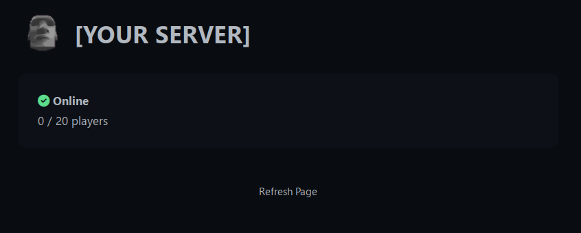

# minecraft_status
Simple webserver to query and display the status of a given minecraft server.



## Env vars

| env var          | description                                                    | default |
|------------------|----------------------------------------------------------------|---------|
| RUST_LOG         | sets logging level                                             | WARN    |
| PORT             | port for server to listen on                                   | 3000    |
| SERVER           | server ip/url to check                                         |         |
| SERVER_PORT      | port to check (will be ignored if applicable SRV record found) | 25565   | 
| REFRESH_INTERVAL | how often to check server status                               | 60s     |

## Usage with docker compose 
```yaml
  minecraft_status:
    image: svvqqrdoiofnohfchkjcdgoixnnsta/minecraft_status
    container_name: minecraft_status
    ports:
      - "80:80"
    environment:
      SERVER: [YOUR SERVER]
      REFRESH_INTERVAL: 5m
      PORT: 80
```

## Usage with docker compose + traefik
```yaml
  minecraft_status:
    image: svvqqrdoiofnohfchkjcdgoixnnsta/minecraft_status
    container_name: minecraft_status
    environment:
      SERVER: [YOUR SERVER]
      REFRESH_INTERVAL: 5m
    labels:
      traefik.enable: true
      traefik.http.routers.status.rule: Host(`status.docker.localhost`)
      traefik.http.services.status.loadbalancer.server.port: 3000
      traefik.http.routers.status.entrypoints: web
```
